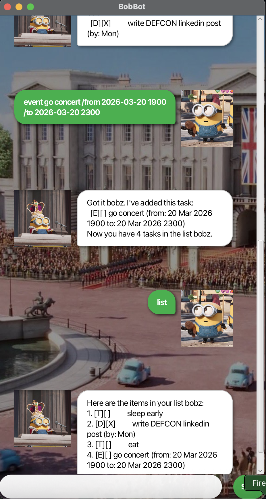

# BobBot Documentation



> "KING BOB!!!!" ~BobBot

BobBot helps you stay organized by managing all the tasks you need to remember. It features,

- simple text interface
- intuitive commands
- **lightning-fast** performance

Getting started is simple:

1. grab the latest version from [GitHub releases](https://github.com/sunshinefactoryyy/ip/releases/latest)
2. run the executable
3. start adding your tasks
4. enjoy seamless task management! 🎯

Completely **FREE** to use!

## Core Features

✅ Task organization  
✅ Deadline tracking  
⏰ Smart reminders (in development)

---

**For developers**: Perfect for Java practice! Here's the entry point:

```java
public class Main {
    public static void main(String[] args) {
        Application.launch(Bob.class, args);
    }
}
```

## Creating Todo Items

Track your daily tasks with BobBot!

**Syntax:** `todo <task_description>`

**Example:** `todo read book`

## Managing Deadlines

Never miss important due dates!

**Syntax:** `deadline <task_description> /by <due_date>`

**Example:** `deadline return book /by 2026-06-06`

## Planning Events

Organize events with start and end dates!

**Syntax:** `event <event_description> /from <start_date> <time> /to <end_date> <time>`

**Example:** `event project meeting /from 2026-07-01 2100 /to 2026-07-02 2359`

## Viewing Your Tasks

Display all your current tasks at a glance!

**Command:** `list`

**Output:**
```
1. [T][ ] sleep early
2. [D][X] write DEFCON linkedin post (by: Mon)
3. [T][ ] eat
4. [E][ ] go concert (from: 20 Mar 2026 1900 to: 20 Mar 2026 2300)

```

## Task Status Management

Mark tasks as done or pending as needed!

**Commands:** `mark <task_number>` or `unmark <task_number>`

**Examples:** 
- `mark 1` - marks task 1 as complete
- `unmark 2` - marks task 2 as incomplete

## Search Functionality

Quickly locate specific tasks using keywords!

**Syntax:** `find <search_term>`

**Example:** `find book`

## Removing Tasks

Clean up your task list by removing completed items!

**Syntax:** `delete <task_number>`

**Example:** `delete 1`

## Undo the Previous Command

Remove the latest command mistake!

**Command:** `undo`

## Closing the Application

Exit BobBot when you're finished!

**Command:** `bye`
